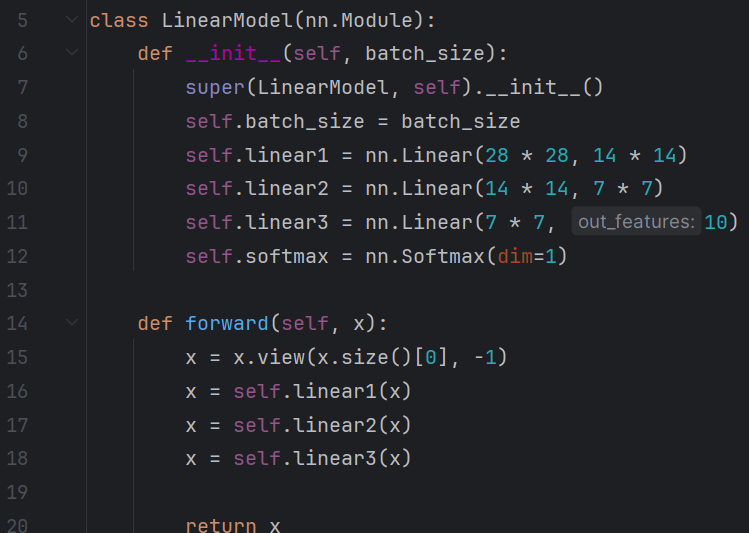
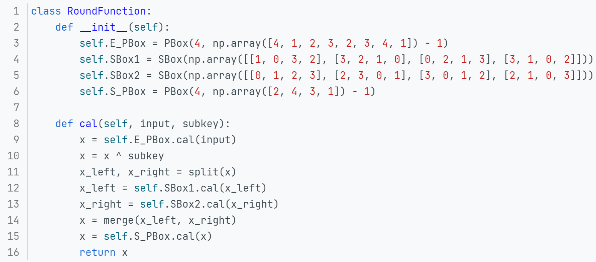

 [中文文档](./中文文档.md)/[English Document](./README.md)

 [User Guide](./Report/用户指南.md)/[Test Results](./Report/测试结果.md)/[API Documentation](./Report/接口文档.md)

[ UI.exe](https://1drv.ms/f/c/98a24b1640a6d498/Ekz8NXd37N5MkW8OaOi6oZsBrXvcY9o9LQoQxxDAVEgVQw)

---

# **Customizable S-DES Encryption Framework**

## **1 Overview**

This project provides a customizable framework for implementing a simplified version of the Data Encryption Standard (S-DES). Unlike traditional implementations of DES, this framework is highly modular and allows users to define their own encryption and decryption processes by configuring permutation boxes (PBox), substitution boxes (SBox), and round functions. The core design of the framework is inspired by the model-stacking approach found in machine learning libraries **like PyTorch**, offering users the flexibility to construct their own encryption models.


If you're familiar with PyTorch, I believe you'll also fall in love with this **building-block** approach to constructing your own encryption machine.




### **1.1 Features**

- **Modular Components**: Key encryption components (PBox, SBox, KeyGenerator, and RoundFunction) are independent and customizable.
- **Customizable Encryption Workflow**: Users can define and stack multiple rounds of encryption, create custom PBoxes and SBoxes, and set their own encryption/decryption flow.
- **Brute Force Attack**: The framework includes a brute force function for testing all possible keys to decrypt a given ciphertext.

This is a Python implementation of the Simplified DES (S-DES) encryption algorithm. It includes encryption, decryption, and brute-force cracking capabilities, with a user interface to showcase these functions.

### **1.2 Project Structure**

```
│  
│  README.md
│  中文文档.md
│      
├─Code
│  │  Cipher.py
│  │  run.py
│  │  UI.py
│  │  utils.py  
│      
└─Report
        接口文档.md
        测试结果.md
        用户指南.md
```

The project structure is as follows:

- **`Cipher.py`**: Contains the core implementation of the Simple-DES algorithm, including:
  - **PBox and SBox classes** for permutation and substitution operations.
  - **KeyGenerator** for generating subkeys used during encryption and decryption.
  - **RoundFunction** that handles round function transformations.
  - **S_DES class** that implements encryption, decryption, and brute-force functions.

- **`run.py`**: A sample script demonstrating how to use the Simple-DES algorithm for encryption, decryption, and brute-force testing via text input.

- **`utils.py`**: Utility functions for data conversion, including:
  - **Splitting and merging** arrays.
  - **Binary and decimal conversion**.
  - **String-to-binary conversion**.

- **`UI.py`**: A PyQt5-based graphical user interface that allows users to:
  - Encrypt and decrypt messages interactively.
  - Perform brute force on encrypted data.
  - Choose between binary input and plaintext input.

## **2 Installation**

Before running the project, ensure that you have Python 3 installed, along with the following dependencies:

- `numpy`
- `PyQt5`

You can install the required packages with the following command:

```sh
pip install numpy PyQt5
```

## **3 Usage**

1. **Command Line Interface**:
   - You can directly run `run.py` to perform encryption, decryption, and brute-force tests from the command line.

   ```sh
   python run.py
   ```

2. **Graphical User Interface**:
   - Run `UI.py` to start the GUI version.

   ```sh
   python UI.py
   ```

   The GUI provides three main tabs:
   - **Encryption**: Input plaintext and key to generate ciphertext.
   - **Decryption**: Input ciphertext and key to recover the original plaintext.
   - **Brute Force**: Based on a given plaintext and ciphertext, use brute force to find the key.

### **3.1 Example**

**Core Concept: Modularity and Flexibility**
The core concept is **modular design**, similar to model-stacking in machine learning frameworks. It allows users to configure various modules to customize their encryption engine. Specifically, it breaks down the steps of DES encryption, enabling each step (such as permutation, substitution, key generation, and encryption rounds) to be configured and modified independently through different modules.

#### **3.1.1 Permutation Box (PBox)**
The **PBox** is a flexible permutation operation that allows users to change the order of input bits by defining `out_order`. This enables users to create custom bit permutation operations beyond the fixed permutation rules in traditional S-DES.

```python
class PBox:
    def __init__(self, in_length, out_order):
        self.in_length = in_length
        self.out_order = out_order

    def cal(self, input):
        result = input[self.out_order]
        return result
```

**Custom PBox Example**:
Suppose you want a 10-bit input and 8-bit output compression permutation box, with the output order `[3, 7, 2, 5, 1, 6, 4, 0]`. You can create a custom PBox as follows:

```python
custom_pbox = PBox(in_length=10, out_order=[3, 7, 2, 5, 1, 6, 4, 0])
```

#### **3.1.2 Substitution Box (SBox)**
The **SBox** is a nonlinear substitution box for binary bitstrings, which maps the input bitstring to the output bitstring by looking up a substitution table (`out_order`). Users can define their own substitution tables to implement custom substitution rules.

```python
class SBox:
    def __init__(self, out_order):
        self.out_order = out_order

    def cal(self, input):
        row_index = [input[0], input[-1]]
        row = binToDec(row_index)
        column_index = input[1:-1]
        column = binToDec(column_index)
        result = self.out_order[row][column]
        result = decToBin(result)
        return result[-2:]
```

**Custom SBox Example**:
Suppose you want to create a new SBox with the following substitution rules:
```python
custom_sbox = SBox(out_order=np.array([
    [2, 1, 3, 0],
    [3, 2, 0, 1],
    [1, 3, 2, 0],
    [0, 1, 3, 2]
]))
```

#### **3.1.3 Key Generation (KeyGenerator)**
The **KeyGenerator** is responsible for generating subkeys (k1 and k2) needed during the DES encryption process. It uses permutation boxes (PBox) and left-shift operations to flexibly generate subkeys.

```python
class KeyGenerator:
    def __init__(self):
        self.P10 = PBox(10, np.array([3, 5, 2, 7, 4, 10, 1, 9, 8, 6]) - 1)
        self.P8 = PBox(8, np.array([6, 3, 7, 4, 8, 5, 10, 9]) - 1)
        self.LeftShift1 = PBox(5, np.array([2, 3, 4, 5, 1]) - 1)
        self.LeftShift2 = PBox(5, np.array([3, 4, 5, 1, 2]) - 1)

    def cal(self, key):
        x = self.P10.cal(key)
        left, right = split(x)
        left, right = self.LeftShift1.cal(left), self.LeftShift1.cal(right)
        x = merge(left, right)
        k1 = self.P8.cal(x)
        left, right = self.LeftShift1.cal(left), self.LeftShift1.cal(right)
        x = merge(left, right)
        k2 = self.P8.cal(x)
        return k1, k2
```

You can customize key generation strategies by modifying the PBox configurations.

#### **3.1.4 Round Function (RoundFunction)**
The **RoundFunction** is a key part of the encryption/decryption operation, involving expansion, SBox substitution, and permutation. This function can be repeated to increase the number of encryption rounds, thus strengthening encryption. Users can customize the SBoxes and PBoxes to flexibly configure the encryption logic.

```python
class RoundFunction:
    def __init__(self):
        self.E_PBox = PBox(4, np.array([4, 1, 2, 3, 2, 3, 4, 1]) - 1)
        self.SBox1 = SBox(np.array([[1, 0, 3, 2], [3, 2, 1, 0], [0, 2, 1, 3], [3, 1, 0, 2]]))
        self.SBox2 = SBox(np.array([[0, 1, 2, 3], [2, 3, 0, 1], [3, 0, 1, 2], [2, 1, 0, 3]]))
        self.S_PBox = PBox(4, np.array([2, 4, 3, 1]) - 1)

    def cal(self, input, subkey):
        x = self.E_PBox.cal(input)
        x = x ^ subkey
        x_left, x_right = split(x)
        x_left = self.SBox1.cal(x_left)
        x_right = self.SBox2.cal(x_right)
        x = merge(x_left, x_right)
        x = self.S_PBox.cal(x)
        return x
```

**Custom RoundFunction Example**:
You can define your own encryption rounds by replacing SBox1, SBox2, or PBox.

#### **3.1.5 S_DES Class: A Flexible Encryption Engine**
The **S_DES** class combines the various modules mentioned above to create a complete encryption engine. It provides

 encryption, decryption, and brute-force functions. By calling the `forward()` method, users can choose encryption or decryption as needed, and insert their own custom logic into the code.

```python
class S_DES:
    def __init__(self):
        self.keyGenerator = KeyGenerator()
        self.IP = PBox(8, np.array([2, 6, 3, 1, 4, 8, 5, 7]) - 1)
        self.LP = PBox(8, np.array([4, 1, 3, 5, 7, 2, 8, 6]) - 1)
        self.roundF = RoundFunction()

    def forward(self, x, key, isEncrypt=True):
        if isEncrypt:
            k1, k2 = self.keyGenerator.cal(key)
        else:
            k2, k1 = self.keyGenerator.cal(key)
        tt = x.reshape((-1, 8))
        result = np.array([], dtype=np.uint8)
        for x in tt:
            x = self.IP.cal(x)
            left, right = split(x)
            left = left ^ self.roundF.cal(right, k1)
            left, right = swap(left, right)
            left = left ^ self.roundF.cal(right, k2)
            x = merge(left, right)
            x = self.LP.cal(x)
            result = np.append(result, x)
        return result
```

Through this code, you can:
- **Customize PBox and SBox**: Use different permutation and substitution rules to build encryption flows that meet specific needs.
- **Increase or decrease encryption rounds**: By modifying the number of times the RoundFunction is called, you can create more complex or simpler encryption systems.
- **Customize key generation strategies**: By adjusting the permutation and shifting logic in the KeyGenerator, you can generate different subkeys.

### Encryption and Decryption

```python
from Cipher import S_DES
import numpy as np
from utils import strToBytes, bytesToStr

machine = S_DES()
key = np.array([0, 1, 1, 0, 1, 0, 0, 0, 1, 1])
plaintext = "who are you"
x = strToBytes(plaintext, False)

ciphertext = machine.forward(x, key, isEncrypt=True)
print("Encrypted: ", bytesToStr(ciphertext, False))

decrypted_text = machine.forward(ciphertext, key, isEncrypt=False)
print("Decrypted: ", bytesToStr(decrypted_text, False))
```

## **4 GUI Screenshots**


## **5 Acknowledgments**

- This project was inspired by the encryption learning examples and basic knowledge of DES encryption in the course "Introduction to Information Security" at Chongqing University.

## **6 Contribution**

- [Shihao F, HuanWei Z]

``` 
We welcome contributions to this project. You can help by adding new features, optimizing existing modules, or creating additional encryption components. 
```

---

