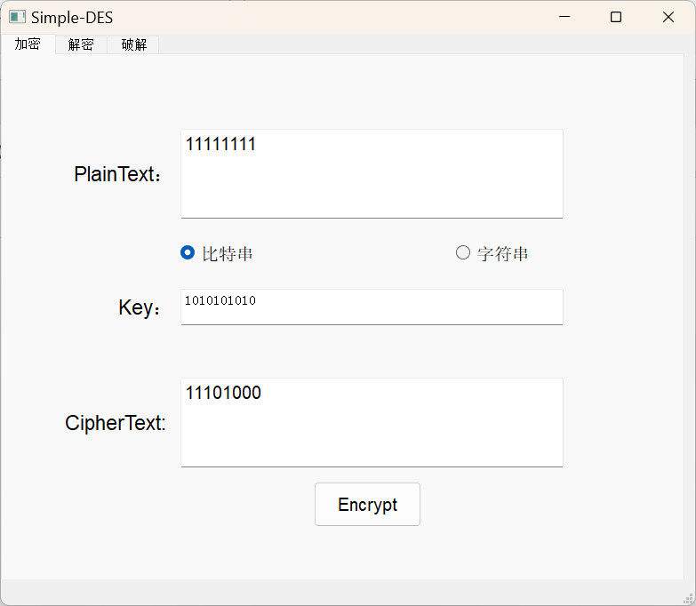
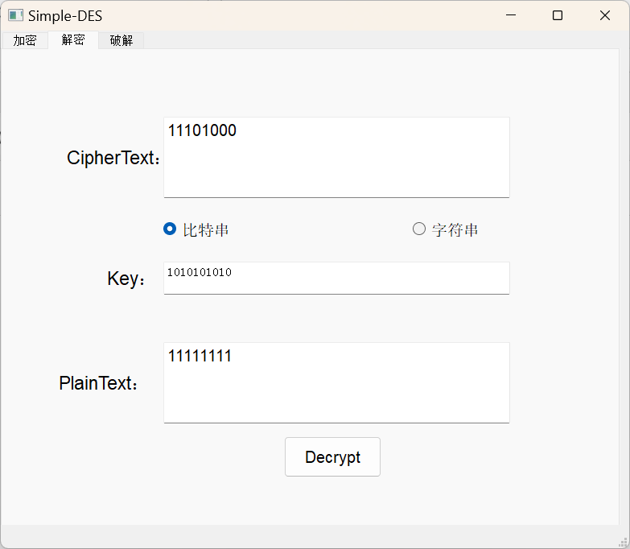
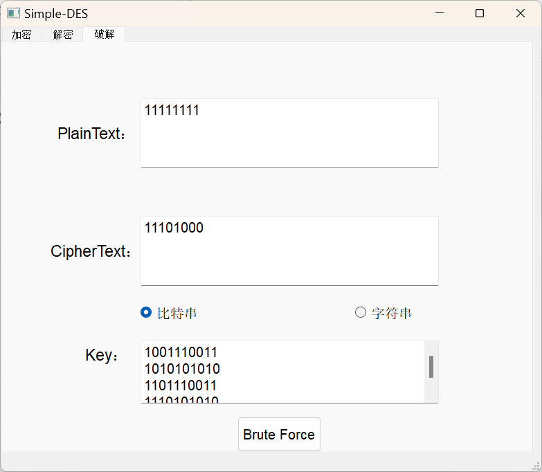

 [中文文档](./中文文档.md)

 [En](./README.md)

 [Simple-DES.EXE](https://onedrive.live.com/?id=98A24B1640A6D498%21s7735fc4cec774cde916f0e68e8baa19b&cid=98A24B1640A6D498)

---

# Simple-DES Implementation

This is a Python implementation of the Simple-DES (S-DES) encryption algorithm. It includes encryption, decryption, and brute-force cracking capabilities, with a user interface to showcase these functions.

## Features

- **Encryption and Decryption**: Encrypt and decrypt text using a Simple-DES algorithm.
- **Brute Force Attack**: Attempt to find the key through a brute-force attack, supporting both plaintext and ciphertext inputs.
- **Graphical User Interface (GUI)**: A PyQt5-based UI for easy interaction with the encryption, decryption, and brute force attack functions.

## Structure

The project is structured as follows:

- **`Cipher.py`**: Contains the core implementation of the Simple-DES algorithm, including:
  - **PBox and SBox classes** for permutation and substitution operations.
  - **KeyGenerator** for generating subkeys used during encryption and decryption.
  - **RoundFunction** that applies the round transformations.
  - **S_DES class** to implement the encryption, decryption, and brute-force functions.

- **`run.py`**: Example script that demonstrates the usage of the Simple-DES algorithm for encryption, decryption, and brute-force attack using textual input.

- **`utils.py`**: Utility functions used for data transformations, including:
  - **Splitting and merging** arrays.
  - **Conversion between binary and decimal**.
  - **String to binary conversion**.

- **`UI.py`**: A PyQt5-based user interface allowing users to interactively:
  - Encrypt and decrypt messages.
  - Perform a brute-force attack on encrypted data.
  - Choose between binary input and plaintext input.

## Installation

To run the project, make sure you have Python 3 installed and the following dependencies:

- `numpy`
- `PyQt5`

You can install the required packages using the following command:

```sh
pip install numpy PyQt5
```

## Usage

1. **Command Line Interface**:
   - You can run `run.py` directly to perform encryption, decryption, and brute force testing via the command line.

   ```sh
   python run.py
   ```

2. **Graphical User Interface**:
   - Run the `UI.py` script to launch the GUI version.

   ```sh
   python UI.py
   ```

   The GUI provides three main tabs:
   - **Encryption**: Enter plaintext and a key to generate ciphertext.
   - **Decryption**: Enter ciphertext and a key to retrieve the original plaintext.
   - **Brute Force**: Use brute-force to find the key based on given plaintext and ciphertext.

## Example

### Encryption and Decryption

```python
from Cipher import S_DES
import numpy as np
from utils import strToBytes, bytesToStr

machine = S_DES()
key = np.array([0, 1, 1, 0, 1, 0, 0, 0, 1, 1])
plaintext = "who are you"
x = strToBytes(plaintext, False)

ciphertext = machine.forward(x, key, isEncrypt=True)
print("Encrypted: ", bytesToStr(ciphertext, False))

decrypted_text = machine.forward(ciphertext, key, isEncrypt=False)
print("Decrypted: ", bytesToStr(decrypted_text, False))
```

## Key Components

- **Key Generation**: Implements key permutation using P-boxes for creating subkeys.
- **Rounds**: Includes two rounds of operations involving expansion, substitution, and permutation.
- **Brute Force Attack**: Finds a valid key by attempting all possible combinations (10-bit keyspace).

## GUI Screenshot









## Acknowledgments

- Inspired by the learning examples of cryptography and the basic knowledge of DES encryption in "Introduction to Information Security" of Chongqing University.

## Author

- [Shihao F, HuanWei Z]
```
You can supplement and modify the Code content according to your own needs
```