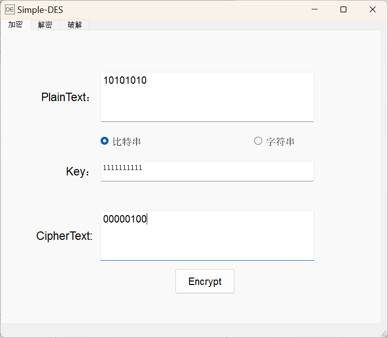
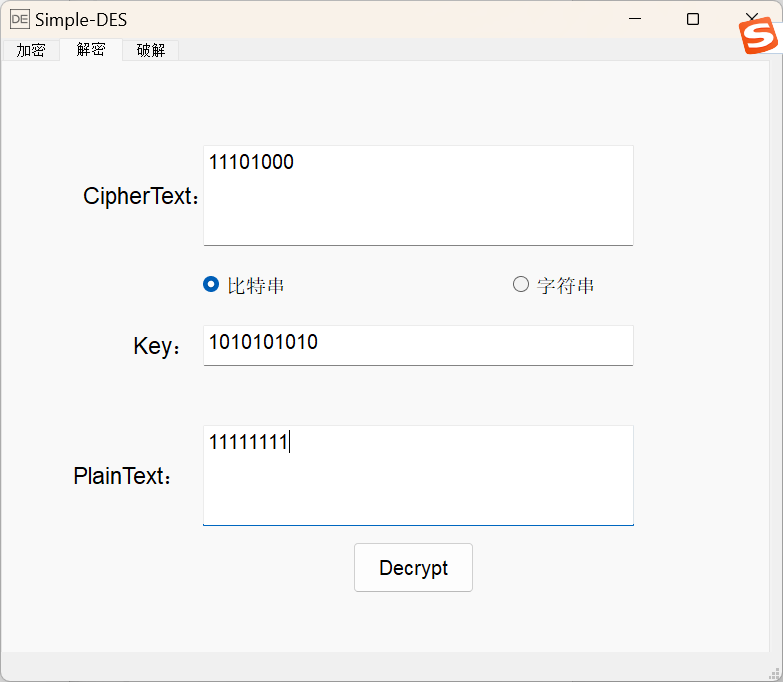
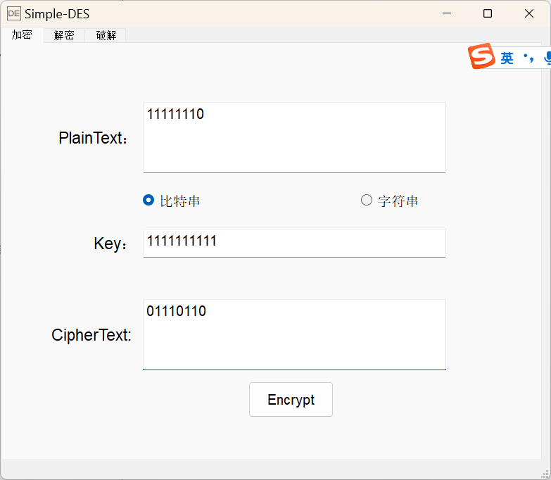
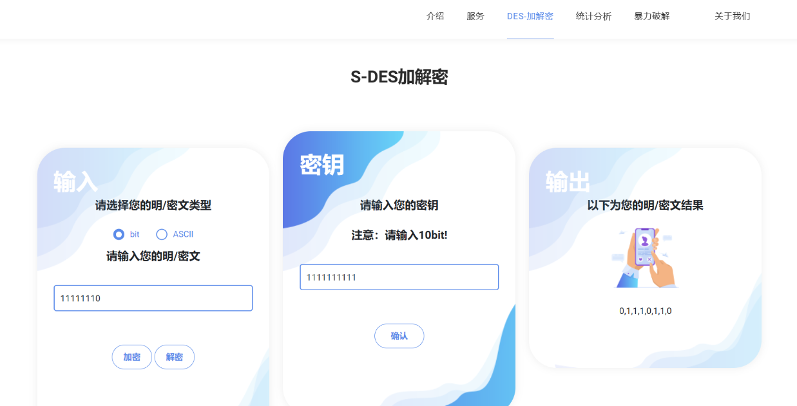
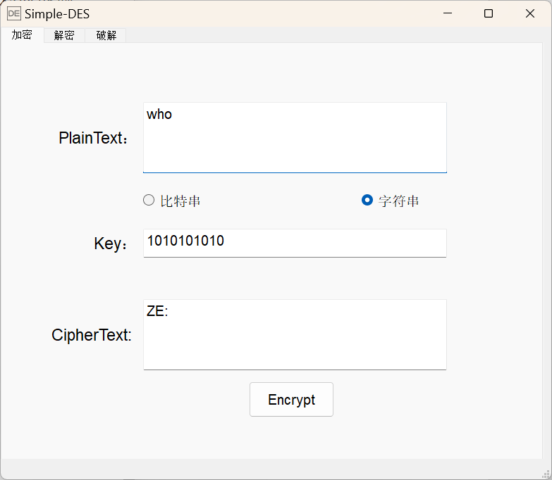
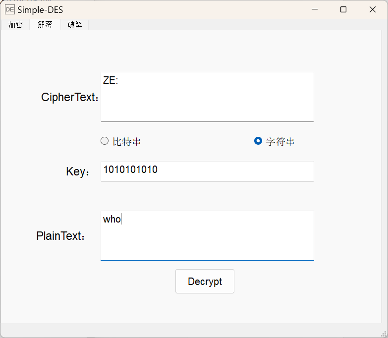
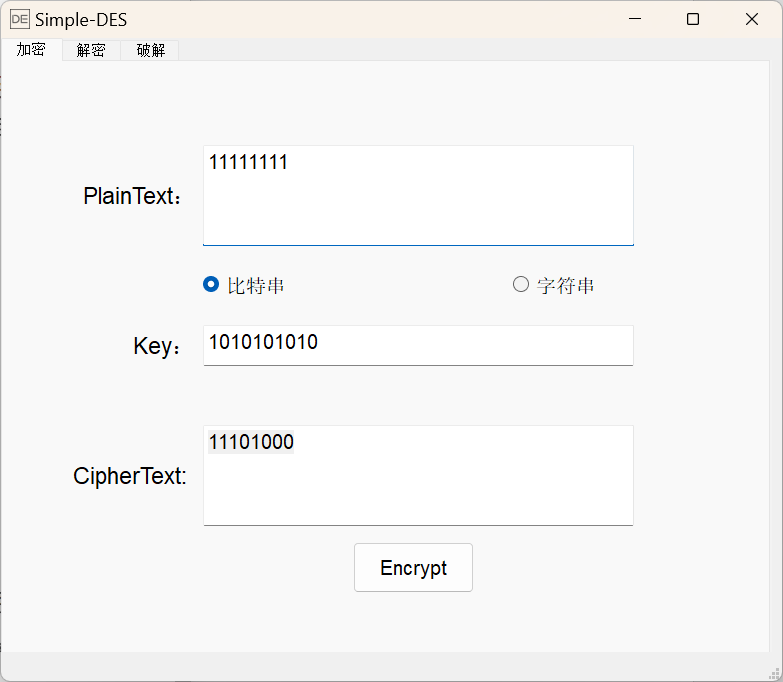
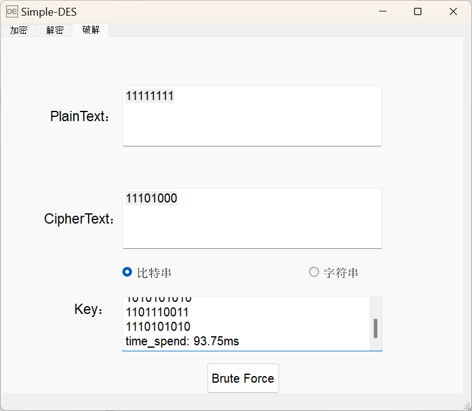
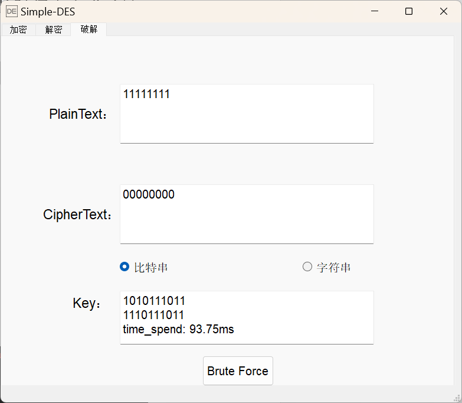

# 测试结果

## 第1关：基本测试

根据S-DES算法编写和调试程序，提供GUI解密支持用户交互。输入可以是8bit的数据和10bit的密钥，输出是8bit的密文。

**加密算法测试结果如下：**

| **明文** |  **密钥**  | **密文** |
| -------- | :--------: | :------: |
| 11111111 | 1111111111 | 00001111 |
| 11111111 | 1010101010 | 11101000 |
| 11111111 | 0000000000 | 00010100 |
| 10101010 | 1111111111 | 00000100 |
| 10101010 | 0000000000 | 00010001 |

**解密算法测试结果如下：**

| **密文** |  **密钥**  | **明文** |
| :------: | :--------: | :------: |
| 00001111 | 1111111111 | 11111111 |
| 11101000 | 1010101010 | 11111111 |
| 00010100 | 0000000000 | 11111111 |
| 00000100 | 1111111111 | 10101010 |
| 00010001 | 0000000000 | 10101010 |

## 第2关：交叉测试

考虑到是**算法标准**，所有人在编写程序的时候需要使用相同算法流程和转换单元(P-Box、S-Box等)，以保证算法和程序在异构的系统或平台上都可以正常运行。

设有A和B两组位同学(选择相同的密钥K)；则A、B组同学编写的程序对明文P进行加密得到相同的密文C；或者B组同学接收到A组程序加密的密文C，使用B组程序进行解密可得到与A相同的P。

* A组(我们组)加密结果

* B组加密结果：

* 两组加密结果相同

## 第3关：扩展功能

考虑到向实用性扩展，加密算法的数据输入可以是ASII编码字符串(分组为1 Byte)，对应地输出也可以是ACII字符串(很可能是乱码)。

加密和解密字符串 **"Who"**，结果如下：

## 第4关：暴力破解

假设你找到了使用相同密钥的明、密文对(一个或多个)，请尝试使用暴力破解的方法找到正确的密钥Key。在编写程序时，你也可以考虑使用多线程的方式提升破解的效率。请设定时间戳，用视频或动图展示你在多长时间内完成了暴力破解。

* 通过密钥 **1010101010** ，加密获得对应的明密文对 **11111111 - 11101000**
* 暴力破解明密文对，将会得到破解时间 ***time_spend: 93.75ms*** ；以及4个可能的密钥，分别为
  * 1001110011
  * 1010101010
  * 1101110011
  * 1110101010
* 经过验证，4个密钥均可正确加密出对应的密文，或者解密出对应的明文

## 第5关：封闭测试

根据第4关的结果，进一步分析，对于你随机选择的一个明密文对，是不是有不止一个密钥Key？进一步扩展，对应明文空间任意给定的明文分组$P_{n}$，是否会出现选择不同的密钥$K_{i}\ne K_{j}$加密得到相同密文$C_n$的情况？

* 随机给出明密文对 **11111111 - 00000000**， 暴力破解发现有两个可能的密钥：
  * 1010111011
  * 1110111011
  * time_spend: 93.75ms

