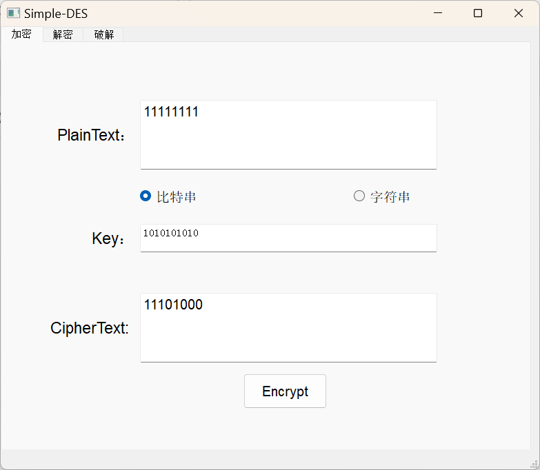

 [中文文档](https://markdown.com.cn)

 [En](./README.md)

 [Simple-DES.EXE](https://onedrive.live.com/?id=98A24B1640A6D498%21s7735fc4cec774cde916f0e68e8baa19b&cid=98A24B1640A6D498)

---

# 简单-DES 实现

这是简单-DES（S-DES）加密算法的 Python 实现，包括加密、解密和暴力破解功能，提供了用户界面来展示这些功能。

## 功能特点

- **加密和解密**：使用简单-DES 算法对文本进行加密和解密。
- **暴力破解**：通过暴力破解尝试找到密钥，支持明文和密文输入。
- **图形用户界面 (GUI)**：基于 PyQt5 的界面，方便用户交互使用加密、解密和暴力破解功能。

## 项目结构

项目结构如下：

- **`Cipher.py`**：包含简单-DES 算法的核心实现，包括：
  - **PBox 和 SBox 类**用于置换和代换操作。
  - **KeyGenerator** 用于生成加密和解密过程中使用的子密钥。
  - **RoundFunction** 负责应用轮函数转换。
  - **S_DES 类**实现加密、解密和暴力破解功能。

- **`run.py`**：示例脚本，展示了如何使用简单-DES 算法进行加密、解密和通过文本输入进行暴力破解。

- **`utils.py`**：数据转换的工具函数，包括：
  - **分割和合并**数组。
  - **二进制和十进制转换**。
  - **字符串到二进制的转换**。

- **`UI.py`**：基于 PyQt5 的用户界面，允许用户交互式地：
  - 加密和解密消息。
  - 对加密数据进行暴力破解。
  - 在二进制输入和明文输入之间进行选择。

## 安装

运行项目前，请确保安装了 Python 3，并安装以下依赖：

- `numpy`
- `PyQt5`

可以使用以下命令安装所需包：

```sh
pip install numpy PyQt5
```

## 使用方法

1. **命令行界面**：
   - 可以直接运行 `run.py` 来通过命令行进行加密、解密和暴力破解测试。

   ```sh
   python run.py
   ```

2. **图形用户界面**：
   - 运行 `UI.py` 启动 GUI 版本。

   ```sh
   python UI.py
   ```

   GUI 提供了三个主要选项卡：
   - **加密**：输入明文和密钥生成密文。
   - **解密**：输入密文和密钥恢复原始明文。
   - **暴力破解**：基于给定的明文和密文，通过暴力破解找到密钥。

## 示例

### 加密和解密

```python
from Cipher import S_DES
import numpy as np
from utils import strToBytes, bytesToStr

machine = S_DES()
key = np.array([0, 1, 1, 0, 1, 0, 0, 0, 1, 1])
plaintext = "who are you"
x = strToBytes(plaintext, False)

ciphertext = machine.forward(x, key, isEncrypt=True)
print("Encrypted: ", bytesToStr(ciphertext, False))

decrypted_text = machine.forward(ciphertext, key, isEncrypt=False)
print("Decrypted: ", bytesToStr(decrypted_text, False))
```

## 关键组件

- **密钥生成**：通过 P-box 对密钥进行置换以生成子密钥。
- **轮函数**：包括两轮操作，涉及扩展、代换和置换。
- **暴力破解**：通过尝试所有可能的组合（10 位密钥空间）找到有效密钥。

## GUI 截图




## 致谢

- 本项目受到重庆大学《信息安全导论》中关于加密学习示例和 DES 加密基础知识的启发。

## 作者

- [Shihao F, HuanWei Z]

```
您可以根据自己的需求补充和修改代码内容。
```